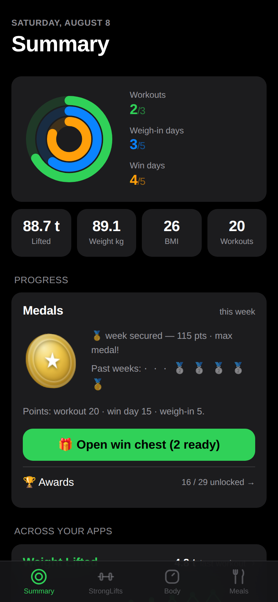
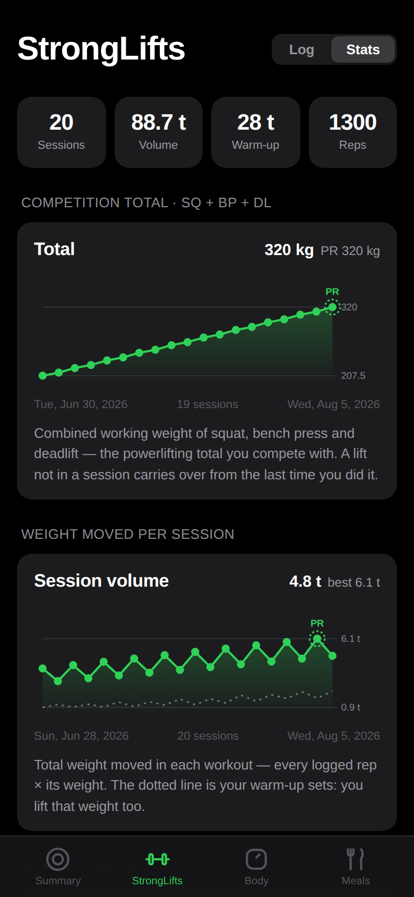
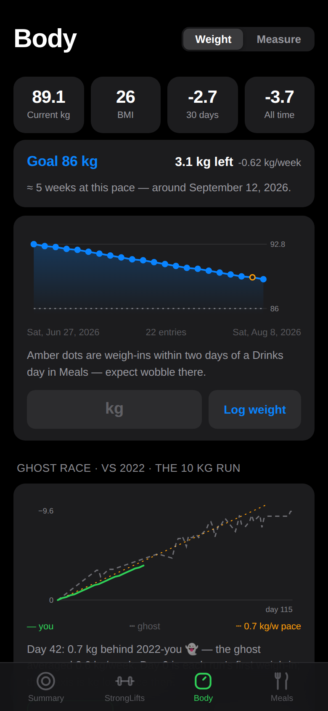
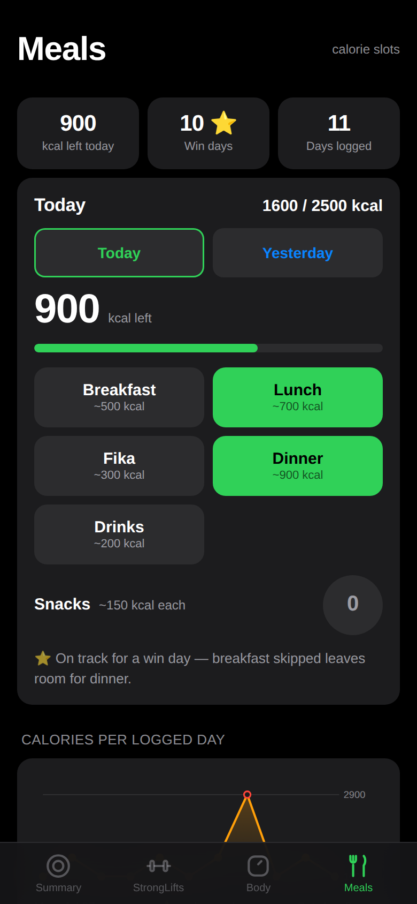
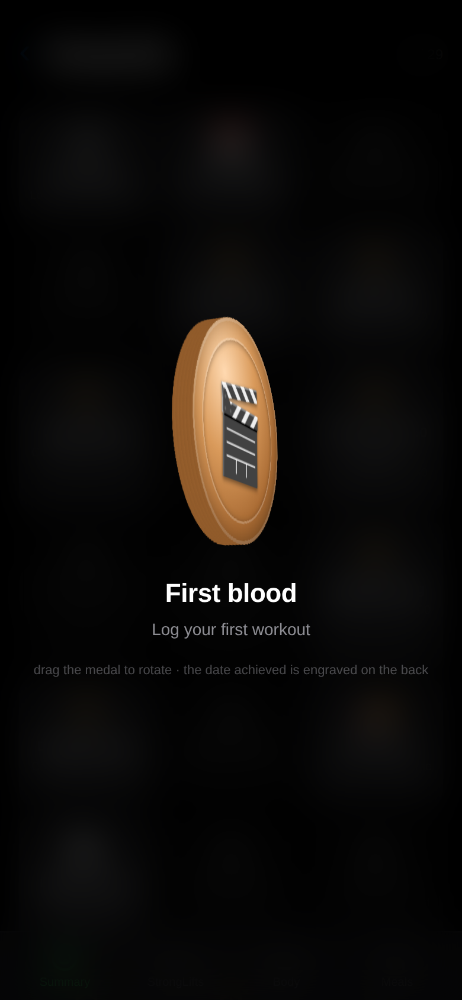

# Health Log

A personal health suite in a single HTML file — no backend, no accounts, no tracking, fully offline. What started as a [StrongLifts 5×5](https://stronglifts.com/) workout logger grew into a small family of apps that share one local data store, styled after Apple's Human Interface Guidelines with Stocks-style charts and a Fitness-style tab bar.

**Open it here → https://monsharen.github.io/stronglifts/**

| Summary | StrongLifts | Body |
|---|---|---|
|  |  |  |

| Meals | Awards |
|---|---|
|  |  |

## The apps

- **Summary** — weekly activity rings (workouts, weigh-in days, win days), cross-app analytics charts (weight lifted, weight logged, calories, waist), data-driven insights ("weeks with 4+ win days: −0.5 kg on the scale"), a monthly recap, weekly medals with 3D rotatable coins, win chests, and gentle reminders.
- **StrongLifts** — the full 5×5 program: alternating A/B workouts, automatic progression (+2.5 kg on success, repeat on failure, 10% deload after three fails), warm-up plans, a per-side plate calculator, a rest timer, and stats including the powerlifting competition total (squat + bench + deadlift), session tonnage with a dotted warm-up line, and per-lift PR charts.
- **Body** — morning weigh-ins with BMI, a goal weight with kg/week pace and a projected arrival date, a ghost race against real past regime runs (beat 2022-you), and tape measurements (waist, chest, arm, thigh) behind a Weight/Measure switch.
- **Meals** — calorie tracking without food diaries: tick meal slots (breakfast, lunch, fika, dinner, drinks, snacks) with rough per-slot estimates against a daily budget. Stay under budget and the day earns a ⭐. Missed days simply don't exist — no streaks, no nagging.
- **Awards** — 29 achievements rendered as 3D medals in themed materials (gold, sapphire, emerald, obsidian…), each engraved on the back with the date it was earned. Everything unlocks retroactively from your logs.

## How to use

1. **Open the app** at the link above (or serve the repo folder with any static file server and open `index.html`).
2. **Log a workout**: StrongLifts tab → *Start workout* → tap the warm-up and work-set circles as you lift (tap once for all reps, tap again to count down). The rest timer starts itself; *Finish & save* when done. The next session's weights are computed for you.
3. **Weigh in each morning** (before breakfast, for a consistent reading): Body tab → type the number → *Log weight*. Set your height and a goal weight in the profile below for BMI, pace and an ETA.
4. **Tick your meals** as the day goes: Meals tab → tap the slots you used. Keeping the day under budget banks a ⭐ win day — the app celebrates with you.
5. **Watch the Summary**: rings fill through the week, medals and chests accumulate, and insights appear once your data can prove something.
6. **Back up occasionally**: Summary → *Copy backup* puts everything on your clipboard as JSON; *Import backup* merges it on another device. Data never leaves your devices otherwise.

Everything is optional and nothing nags: reminders are opt-in (a workout nudge after 3+ idle days, a morning weigh-in nudge after two missed days), and skipped days are expected, not punished.

## Install as an app (PWA)

Health Log is a Progressive Web App — it installs to your home screen and works fully offline:

- **iPhone / iPad**: open the link in Safari → Share → **Add to Home Screen**. The app runs full-screen with its own icon; the app badge shows due reminders (iOS 16.4+).
- **Android**: open in Chrome → menu → **Install app** (or accept the install banner).
- **Desktop**: Chrome/Edge show an install icon in the address bar.

After an update is deployed, the installed app picks it up on the next launch or two (cache-then-refresh service worker).

Your data lives in the browser's local storage of the installing browser — use the backup copy/import to move history between browsers or devices.

## Development

- `index.html` — the entire app: styles, all apps, charts (hand-rolled SVG), 3D medals (pure CSS transforms), celebration engine. No dependencies, no build step.
- `sw.js` — offline cache; bump the `CACHE` version when shipping UI changes.
- `manifest.webmanifest` + icons — PWA install metadata.

To develop: edit `index.html`, open it in a browser, refresh. All data keys are prefixed `sl.` in localStorage; the export format is a single JSON object.
