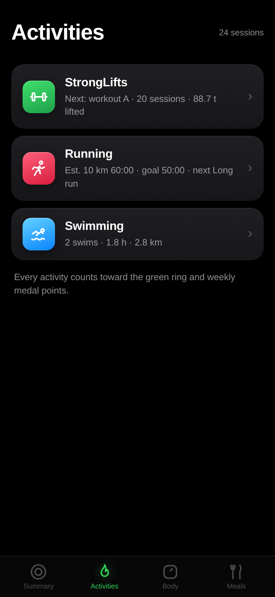

# Health Log

My personal health app. Everything runs in a single HTML file in the browser. No backend, no accounts, no tracking. All data stays on the device.

**Open it here: https://monsharen.github.io/stronglifts/**

| Summary | Activities | StrongLifts |
|---|---|---|
|  |  |  |

| Body | Meals | Awards |
|---|---|---|
|  |  |  |

## What's inside

- **Summary**: weekly activity rings (activities, weigh-in days, win days) with a weekly mix target (2 strength + 2 cardio), an energy balance card that weighs calories in from meals against basal burn plus every activity and says what the pace means for my goal, charts for weight lifted, weight logged, calories and waist, insights computed from my own data, a monthly recap, a This Week card that earns a bronze, silver or gold medal from the week's effort, and optional reminders.
- **Activities**: a landing page of activities, each its own app. StrongLifts is the full 5x5 logger. Alternating A/B workouts, automatic progression (+2.5 kg on success, repeat on failure, 10% deload after three fails, and an easier weight after a layoff since strength fades with time off), warm-up plans, a per-side plate calculator and a rest timer. Stats include the competition total (squat + bench + deadlift), session tonnage with warm-ups as a dotted line and PR charts per lift. Running is an adaptive 10 km programme: sessions rotate Intervals, Tempo and Long run with paces derived from an estimated 10 km time that drops 30 s per completed cycle, deloads after three straight fails, and re-baselines whenever a measured 10 km run beats the estimate. Cycling logs rides, and my Tuesday/Thursday office commute goes in with one tap. Swimming logs time in the water and distance when available, with pace per 100 m. Every activity counts toward the green ring, the weekly medals and the energy balance.
- **Body**: morning weigh-ins with BMI, a goal weight with pace and estimated finish date, a ghost race against my earlier runs, and tape measurements (waist, chest, arm, thigh) behind a Weight/Measure switch.
- **Meals**: no calorie counting, just meal slots. Tick breakfast, lunch, fika, dinner, drinks and snacks against a daily budget. A day under budget earns a star. Missed days are fine and count against nothing.
- **Awards**: 36 achievements as rotatable 3D medals in different materials, with the date earned engraved on the back. Everything unlocks from logged data, nothing to claim.

## How to use

1. Open the app at the link above.
2. Log activities in Activities. StrongLifts: Start workout, tap the circles as you lift (once for all reps, again to count down), then Finish & save. The next session's weights are calculated automatically.
3. Weigh in each morning before breakfast in Body. Set height and goal weight in the profile to get BMI, pace and a finish date. Add birth year and sex too and the summary shows the energy balance.
4. Tick meals during the day in Meals. Stay under budget to earn the star. Yesterday can be backfilled if a day slips.
5. Check Summary for rings, medals, recaps and insights.
6. Back up now and then: Copy backup in Summary puts everything on the clipboard as JSON, Import backup merges it on another device.

Reminders are opt-in: an activity nudge after 3+ idle days that suggests what fits the day (office days point at the commute and the gym, home days at a run) and a morning weigh-in nudge after two missed days. Nothing else nags.

## Install as an app (PWA)

- iPhone/iPad: open in Safari, tap Share, then Add to Home Screen.
- Android: open in Chrome, menu, Install app.
- Desktop: install icon in the address bar in Chrome/Edge.

Works fully offline once installed. Updates arrive on the next launch or two. Data lives in the browser that installed it, so use backup to move history between devices.

## Development

- `index.html`: the entire app. Styles, all views, hand-rolled SVG charts, CSS-transform 3D medals, celebration effects. No dependencies, no build step.
- `sw.js`: offline cache. Bump `CACHE` when shipping changes.
- `manifest.webmanifest` + icons: PWA metadata.

Edit `index.html`, open in a browser, refresh. Data is stored in localStorage under `sl.*` keys and the export format is a single JSON object.
